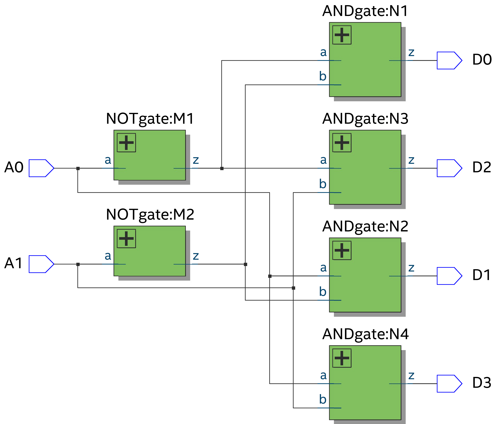
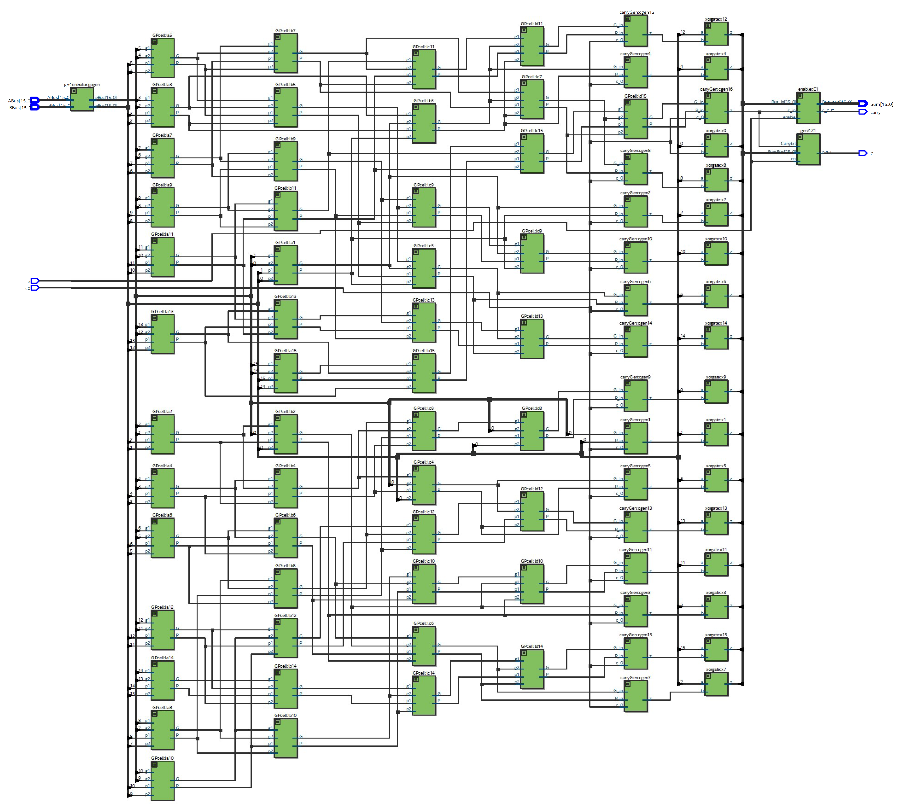
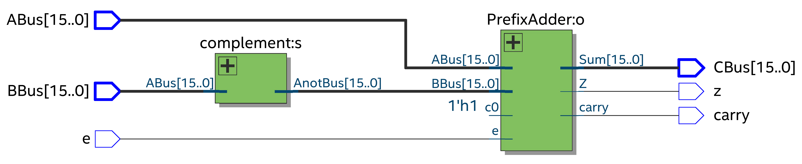
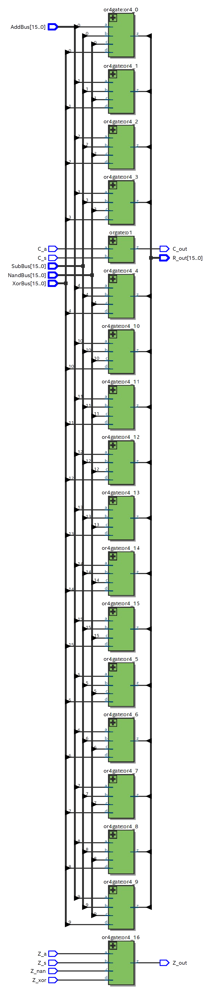

# EE-224-Projects

Team Members: Darin Jeff, Aanal Sonara, Madhav Vadlamani, Param Rathour 
	- Here is the final code for the ALU project with the different components brought together.
	- To run this on your own machines, create a project named ALU and download these files into the project folder.

## Design

<table style="text-align:center;">
  <tr>
    <td>ALU Schematic.png</td>
  </tr>
  <tr>
    <td></td>
  </tr>
</table>

Inputs: 2 16-bit numbers in 2’s complement form (A, B), Control bits (S0, S1)
	- Signed Addition (control input S1S0 = 00) 
	- Subtraction (Control input S1S0 = 01) 
	- NAND operation (control input S1S0 = 10) 
	- XOR operation (control input S1S0 = 11)

Outputs: 1 16-bit number (R), 1 carry bit (C), 1 zero bit (Z)
Note: For arithmetic operations; we used Kogge Stone Adder

**The result is 17-bit in 2’s complement form** (with carry bit as MSB concatenated by result bits (R))

<table style="text-align:center;">
  <tr>
    <td>Output Waveforms</td>
  </tr>
  <tr>
    <td></td>
  </tr>
</table>

<table style="text-align:center;">
  <tr>
    <td>Decoder2to4</td>
  </tr>
  <tr>
    <td></td>
  </tr>
  <tr>
    <td>PrefixAdder</td>
  </tr>
  <tr>
    <td></td>
  </tr>
  <tr>
    <td>Subtractor</td>
  </tr>
  <tr>
    <td></td>
  </tr>
  <tr>
    <td>NAND 16</td>
    <td>XOR 16</td>
    <td>BigOR</td>
  </tr>
  <tr>
    <td></td>
    <td></td>
    <td></td>
  </tr>

</table>